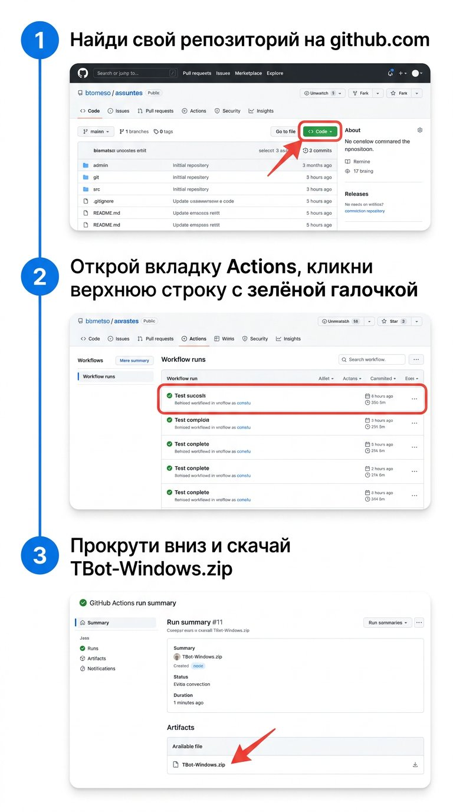

# 📘 Инструкция для пользователя (не программиста)

Эта инструкция приведёт тебя к работающей программе **TBot** на твоём Windows 11.
Никакие команды, никакой код — только мышка и браузер.

Всё займёт примерно **20–25 минут**, из них 15 — это ожидание автоматической сборки.

---

## 🗺 Что мы будем делать

1. Загрузим проект на твой аккаунт GitHub (5 минут).
2. Подождём, пока GitHub САМ соберёт `.exe` (10–15 минут, без твоего участия).
3. Скачаем готовый файл (1 минута).
4. Создадим токен для песочницы Т-Инвестиций (3 минуты).
5. Запустим программу, вставим токен — готово! (2 минуты).

---

## ШАГ 1. Загрузить проект на GitHub

### 1.1. Скачай проект себе на компьютер

Открой в браузере ссылку, которую тебе пришлёт ассистент (или используй "Скачать ZIP" из workspace).
Получится файл вроде `tbot.zip`. **Распакуй** его в любую папку (например, на рабочий стол).

### 1.2. Создай новый репозиторий на GitHub

1. Зайди на **https://github.com/new**
2. Заполни:
   - **Repository name**: `tbot` (или любое название)
   - **Public** или **Private** — на твой выбор (Private = никто кроме тебя не увидит)
   - **НЕ** ставь галочки "Add README", "Add .gitignore", "Add license" — у нас уже всё это есть
3. Нажми зелёную кнопку **Create repository**

### 1.3. Загрузи файлы

На странице нового пустого репозитория ты увидишь надпись
**"...or push an existing repository from the command line"**.

**Игнорируй её.** Вместо этого:

1. На той же странице кликни ссылку **"uploading an existing file"**
   (она в строчке "Get started by creating a new file or **uploading an existing file**")
2. Откроется окно с большой пунктирной рамкой "Drag files here"
3. Открой папку с распакованным проектом, **выдели всё содержимое** (Ctrl+A) и перетащи в эту рамку
4. Подожди, пока загрузится индикатор внизу
5. Прокрути страницу вниз, нажми зелёную кнопку **Commit changes**

**Готово!** Файлы у тебя на GitHub.

---

## ШАГ 2. Дождаться, пока GitHub соберёт .exe

Эту часть GitHub делает САМ — ничего нажимать не нужно.

1. На странице своего репозитория сверху нажми вкладку **Actions**
   

2. Увидишь строчку с названием последнего изменения и жёлтым кружком ⏳ — это значит "идёт сборка".
   Подожди **10–15 минут** (можно закрыть вкладку, сборка идёт на серверах).

3. Когда сборка закончится, кружок станет зелёным ✅. Если красным ❌ — кликни на строку,
   там будет видно, что пошло не так, и пришли мне скриншот.

---

## ШАГ 3. Скачать готовый .exe

1. Кликни по строчке со **зелёной галочкой ✅** в Actions
2. Прокрути страницу в самый низ
3. Внизу будет раздел **Artifacts** и файл **TBot-Windows.zip** — кликни по нему, чтобы скачать
4. **Распакуй** скачанный ZIP в любую папку (например, `C:\TBot\`)
5. Внутри найдёшь файл **TBot.exe** — это и есть наша программа

> ⚠️ Windows может показать предупреждение SmartScreen — "Защитник Windows" не знает наш файл,
> потому что у него нет официальной подписи. Это нормально для собственных программ.
> Нажми **"Подробнее" → "Выполнить в любом случае"**.

---

## ШАГ 4. Получить токен Т-Инвестиций (песочница)

1. Открой в браузере **https://www.tbank.ru/invest/settings/**
2. Найди раздел **"Токены для API"** (может называться "Токены OpenAPI")
3. Нажми **"Создать токен"**
4. В типе токена выбери **"Песочница"** (НЕ "Полный доступ"!)
5. Назови, например, `tbot-test`
6. Нажми **"Создать"**
7. Скопируй показавшийся токен (длинная строка, начинается с `t.`)

🛡 **Важно:** этот токен — для **виртуальных** денег. На реальный счёт он не повлияет.
Сохрани его в надёжном месте (например, в заметках на телефоне), потому что повторно его не покажут.

---

## ШАГ 5. Запустить программу

1. **Двойной клик** по `TBot.exe`
2. Откроется тёмное окно как у трейдинговых терминалов
3. Сверху нажми **⚙ Настройки**
4. В появившемся окне:
   - **Брокер**: выбери "Т-Инвестиции"
   - **Режим**: оставь галочку "Песочница (рекомендуется)" ✅
   - **API-ключ**: вставь свой токен (Ctrl+V)
   - Остальные параметры можно не трогать
5. Нажми **OK**
6. Программа сама подключится, и слева появится список облигаций ОФЗ
7. Кликни любую — справа загрузится график

### 🤖 Включить автоторговлю (на виртуальных деньгах!)

В верхней панели нажми **▶ Запустить агента**.
Бот начнёт анализировать рынок и сам делать сделки. Все сделки появятся справа в таблице
и точками на графике. PnL внизу покажет результат за день (на виртуальном счёте).

---

## ❓ Если что-то не работает

| Проблема | Решение |
|---|---|
| Сборка на GitHub упала ❌ | Кликни на красную строку в Actions, сделай скриншот ошибки и пришли мне |
| `TBot.exe` не запускается, мигает окно | Возможно, антивирус заблокировал. Добавь папку с программой в исключения |
| "Не подключено" в программе | Перепроверь, что токен скопирован полностью (без пробелов в начале/конце) и что выбрана "Песочница" |
| Слева пустой список ОФЗ | Возможно, у Т-Инвестиций нет связи. Закрой и открой программу, проверь интернет |
| Программа вылетает | Открой папку `%APPDATA%\TBot\logs\` — там файл `tbot.log`. Пришли мне его |

---

## 🔐 Безопасность — главные правила

- ✅ Используй **только токен типа "Песочница"** — это виртуальные деньги
- ❌ **Никогда не публикуй токен** в чатах, скриншотах, GitHub, соцсетях
- 🗑 Когда наиграешься — удали токен в кабинете Т-Инвестиций
- 💰 НЕ переключай "Боевой режим" в настройках, пока не убедишься, что стратегия выгодна на песочнице

---

## Что дальше?

Когда захочешь:
- сменить параметры стратегии — в "⚙ Настройки";
- посмотреть, чему научился бот — кнопка "🧠 Переобучить агента";
- использовать другого брокера — заглушки для Финам/БКС уже подготовлены, скажи мне, и я подключу.
